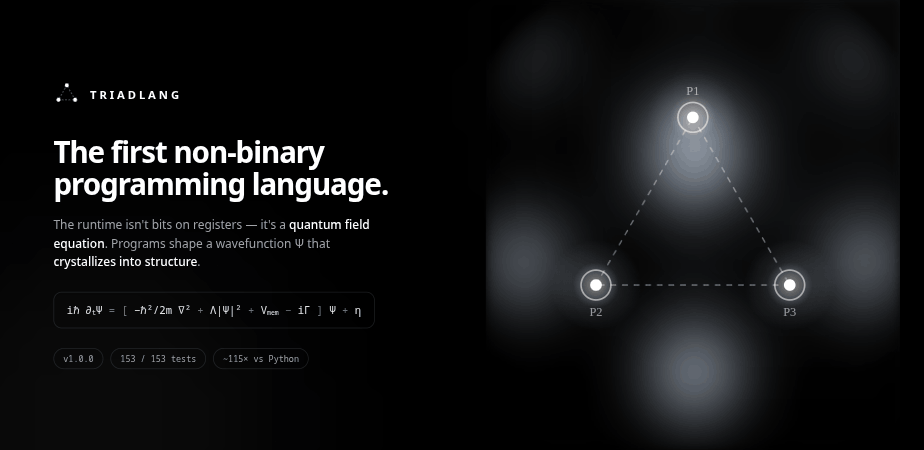

# TriadLang

### The first non-binary programming language.

Most languages compile to **bit operations on registers**.
TriadLang compiles to the **evolution of a continuous wavefunction `Ψ`**  governed by a quantum field equation.
Programs don't push bits. They shape a field that **crystallizes into structure**.

[**Website**](https://triadlang.com) · [**How it works**](docs/HOW_IT_WORKS.md) · [**Benchmarks**](docs/BENCHMARKS.md) · [**Quantum**](docs/QUANTUM.md)

---

## License

TriadLang is **proprietary, source-available** software. © 2026 qrv0. All rights reserved.

It is public for **authorship proof, inspection, evaluation, and reproducibility** only. Public visibility does **not** grant permission to use commercially, copy, modify, redistribute, train AI on, or create derivatives without written permission. See [LICENSE](LICENSE) for the full terms.

**Commercial licensing & contact:** [qrv0@triadlang.com](mailto:qrv0@triadlang.com)
